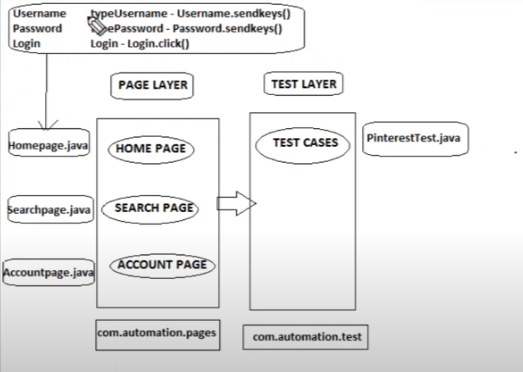

POM
It is a design pattern
Dealing with Pages as seperate Java Classes
Script is easier to maintain and understand
Every page in the appliaction will have a seperate JavaClass
All WebElements will be declared as variables
Corresponding methods acting on variables

- [ ] POM w/o PageFactory
- [ ] POM w PageFactory
- [ ] Test Data Management
- [ ] Extent Reports
- [ ] Automating workflow
- [ ] Paramterization
- [ ] Selenium Waits
- [ ] Assertions
